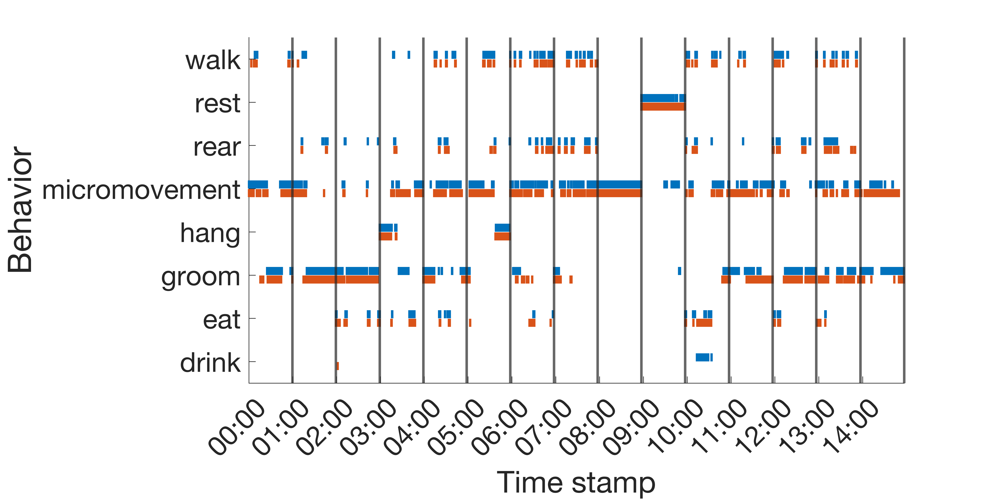

<p align="center">
  
[](https://pypi.com/project/pip/)


 


[](https://www.mathworks.com/matlabcentral/fileexchange/114060-deepaction)
  </p>

# DeepAction

In this repository we provide the code and annotation GUI for DeepAction, a MATLAB toolbox for automatic annotation of animal behavior in video described in the preprint [here](https://www.biorxiv.org/content/10.1101/2022.06.20.496909v1). Our method extracts features from video and uses them to train a birectional LSTM classifier, which in addition to predicting behavior generates a confidence score for the predicted label. These confidence scores allow for the selective review and correction of ambiguous annotations while omitting unnecessary review. 


Included in this repository is:

* The code for the workflow
* The MATLAB app GUIs
* Project method, configuration file, and GUI documentation
* And two demonstration projects to cover the entire DeepAction pipeline


<p align="center">


</p>

<p align="center">


</p>

<p align="center">


</p>

## Table of contents
1. [Getting started](#getting_started)  
2. [Example projects](#example_projects)
3. [Documentation](#documentation)
4. [Key folders & files](#key_folders_files)
5. [References](#references)
6. [Release notes](#release_notes)
7. [Author](#author)
8. [License](#license)


<a name="getting_started"></a>
## Getting started 


### Adding the toolbox to your MATLAB search path

All this is required to begin using DeepAction is to add the toolbox folder to your MATLAB search path. The command to do this is below:


```
addpath(genpath(toolbox_folder));
savepath;

```

where `toolbox_folder` is the path to the toolbox repository. The command `savepath` saves the current search path so the toolbox doesn't need to be added to the path each time a new MATLAB instance is opened. Don't include it if this is not desirable.


<p align="center">
<!---->
</p>

<p align="center">
<!---->
</p>

<p align="center">
<!---->
</p>


<a name="example_projects"></a>
## Example projects

To demonstrate the toolbox, we run the workflow below using the home-cage dataset from Juang et al (see [references](#references)). These demonstration projects are designed to familiarize users with the toolbox, while minimizing the time- and computationally-intensive components of the workflow (i.e., generating temporal frames and spatiotemporal features). Scripts can be found in the `examples` folder.


To do demonstrate different facets of the toolbox, we split the demonstration into two sets. In the first, we show how to create a project, extract features, and launch the annotator. The data for this project are a series of short clips (5 minutes each), selected to decrease the time required to generate frames and features. In the second project, we guide users through training and evaluating the classifier and confidence-based review, as well as launching the confidence-review annotator. For this project we provide pre-extracted features, we well as the corresponding annotations, for all the videos in the home-cage dataset.  

<p align="center">

</p>

### Downloading the example datasets

The example data can be found via Google Drive link [here](https://drive.google.com/drive/folders/1jE6OKFNRZqhdqCmZ_--5uEfTUMBtxRnF?usp=sharing). The contents of the example folder are as follows:

* The subfolder `project_1_videos` contains the demonstration videos that will be used in Project 1. 
* The subfolder `project_2` contains the annotations, spatial/temporal features, and dimensionality reduction model for the entire home-cage dataset, which is used in Project 2.
* The subfolder `example_annotations` contains the files used in the minidemonstration for converting existing annotations into a DeepAction-importable format. 

<!--* The subfolder `full_database` contains videos and annotations from the home-cage dataset. We use this project in the Mini-demonstration below to show how pre-existing annotations can be imported into a DeepActionProject. -->
<!--* In addition, we also include the script, `create_project_1.m`, that was used to generate `new_project_demo_data` from `full_database`. -->


<p align="center">

</p>

### Project 1: Workflow steps #1-5 
In this project we provide a small number of short video clips from the home-cage dataset, and demonstrate steps 1-5 on the workflow below. The file to run this is `demo_project_1.mlx` in the `examples` folder of this repository. In this script, users:

1. Initialize a new project
2. Import a set of 5 shortened videos from the home-cage dataset
3. Extract the spatial and temporal frames from the project videos
4. Use the spatial and temporal frames to create spatial and temporal features
5. Create a dimensionality reduction model
6. Launch the annotator to familiarize with the annotation process


<p align="center">

</p>


### Project 2: Workflow steps #6-11 
In the second set, we provide annotations as well as the spatial and temporal features needed to train the classifier, and guide users through the processes of training and evaluating the classifier and running the confidence-based review. The file to run this project is `demo_project_2.mlx` in the `examples` folder. Here, users:

1. Load spatiotemporal features using the provided dimensionality reduction model
2. Split annotated clips into training, validation, and test sets
3. Train and evaluate the classifier
4. Create confidence scores for each clip
5. Launch the annotator to explore the confidence-based review GUI
6. Export annotations


<p align="center">

</p>


### Mini-demonstration: Importing existing annotations into a DeepAction project

In addition, we also provide a demonstration of how to import annotations from a `.csv` file into a new DeepAction project. The code to run this demonstration can be found in the `FormatAnnotations.mlx` file in the `examples` folder.


<a name="documentation"></a>
## Documentation

In the `documentation` folder, we provide markdown files containing descriptions for the [configuration files](./documentation/config.md), [GUI](./documentation/GUI.md), and [DeepAction functions](./documentation/functions.md).


<p align="center">

</p>

<a name="key_folders_files"></a>
## Key project folders & files

`./project_folder/config.txt` configuration file (see [here](./documentation/config.md))

`./project_folder/annotations` annotations for each video

`./project_folder/videos` raw video data imported into the project

`./project_folder/frames`  spatial and temporal feames corresponding to the video data in `videos`

`./project_folder/features` spatial and temporal video features

`./project_folder/rica_model` dimensionality reduction models (only one model needs to be created for each stream/camera/dimensionality combination)

<a name="references"></a>
## References
* [Home-cage dataset](https://cbmm.mit.edu/mouse-dataset) - dataset used in demonstration projects. Also see:
Jhuang, H., Garrote, E., Yu, X., Khilnani, V., Poggio, T., Steele, A. D., & Serre, T. (2010). Automated home-cage behavioural phenotyping of mice. Nature communications, 1(1), 1-10.
* [Piotr's toolbox](https://pdollar.github.io/toolbox/) - used for reading/writing `.seq` files (and a version of this release is included in the `./toolbox-master` subfolder).
* [Dual TVL1 Optical Flow](https://github.com/vinthony/Dual_TVL1_Optical_Flow) - used to estimate TV-L1 optical flow and create temporal frames
* [CRIM13 dataset](https://data.caltech.edu/records/1892) - used in the preprint (but not the example projects)
* [EZGif.com](https://ezgif.com/video-to-gif) - used to create GIF files from video

<a name="release_notes"></a>
## Release notes

As this is the initial release, we are expecting users might run into issues with the program. With this in mind, annotations are backed up each time the annotator is opened (so, if there's some sort of data loss/mistake/bug when using the annotator, or other components of the workflow that access annotation files, prior annotations can be restored from file). Please raise any issues on the issues page of the GitHub repository, and/or contact the [author](#author) in the case of major problems. In the near future, the "to-do" items are:

* Releasing a multiple-camera example project and improving multiple-camera usability.
* Improved method documentation! (The main methods are covered in [functions.md](./documentation/functions.md), but full details and sufficient in-code documentation is incomplete.)
* Improving the annotator video viewer to reduce lag.
* ... and quite a few other miscellaneous items

If you're interested in contributing, please reach out!

<a name="author"></a>
## Author 

All code, except that used in [references](#references), by Carl Harris (email: carlwharris1 at gmail).

<a name="license"></a>
## License

This project is licensed under the MIT License - see the [LICENSE](LICENSE) file for details

