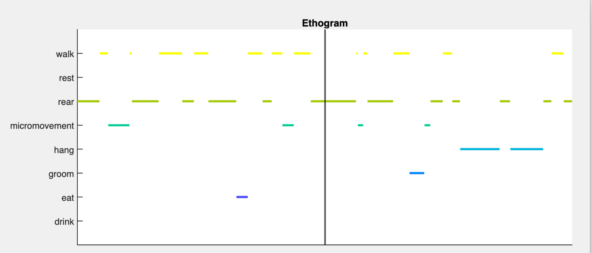

# DeepAction GUI

## The project behaviors app

The project behaviors app is used to define the behavior set for a given project. Call it using the function `BehaviorTable(project)` where `project` is the project path. Each behavior includes a name and a keyboard key, used to define the start/stop of the behavior in the annotator (see below). The available actions (add/remove behavior, move label) are self-explanatory. By default, the project will include a single behavior `UL`, which stands for "unlabeled." By default all of the video is unlabeled. 

## The annotation GUI

### Video viewer and main figure panel

After a clip has been loaded (see below), its video is shown in the viewer panel. Users then increase or decrease playback speed via the buttons shown below the panel **or** by using the arrow keys on the keyboard. The right arrow key increases playback speed, the left arrow key decreases it, and the up arrow key pauses the video. Video playbackspeed ranged fro m 0 (paused) to 30x in both the forward and backward direction. Video playback speed is denoted by the value corresponding to the ***Playback speed*** label. 

Once a video has been loaded, it can be annotated using the key strokes corresponding to the "Key" coumn of the behavior label table (see below). Pushing the arrow key starts/stops the annotation for a given behavior. Labels corresponding to the behavior in each frame of the clip are shown in the ***Ethogram*** plot. The behavior currently selected is shown next to the ***Current behavior*** label. If no behavior is shown, the annotation is not being modified. 

### *Current clip* panel
Shows the clip number, video name, duration, and confidence score (if using the annotator during confidence-based review) for the clip currently being annotated.

### *Annotation files* panel

In this panel, users select clips to annotate. Users select clips to annotate by clicking on the corresponding row in the ***Incomplete annotations*** or ***Complete annotations*** table. After a click is selected, it is loaded via the ***Load video*** button. The loaded clip's clip number, 

#### *Incomplete* and *Complete* annotations* tables

These tables show the annotated/reviewed and unreviewed clips in the user's project. Columns indicate the clip number, corresponding project video, and clip duration. In the cas of confidence-based review, a "score" column is also shown for each clip, indicating that clip's confidence score. Clips are selected by clicking on table rows.

#### *Annotation progress* panel

Gives statistics about annotation progress (i.e., percent of annotations completed and total time manually annotated).Important to note here is the entry corresponding to the label "Est. incomplete annotaiotn accuracy." This value represents the confidence score for all un-annotated clips.  

### *Actions* panel

* **Load video** button: designates the clip selected from the incomplete or complete annotations table as the "current" clip for annotation
* **Mark complete** button: marks the current clip as complete
* **Mark incomplete** button: marks the current clip as incomplete
* **Save progress** button: updates the project annotation files. Done after closing the annotator as well.

### *Project information* panel

Provides information and statistics about the current project. 

### *Ethogram* plot

This plot shows the behaviors annotated (either manually or by the classifier) for the selected clip. If no behavior is annotated, the corresponding time point is blank. The dark black line denotes the current frame. 

### *Behavior labels* panel

Shows a table with each behavior in the current project and the corresponding keyboard key to start/stop annotation of that behavior. Edit/add/delete behaviors prior to annotation using the ***Project behaviors*** GUI. 